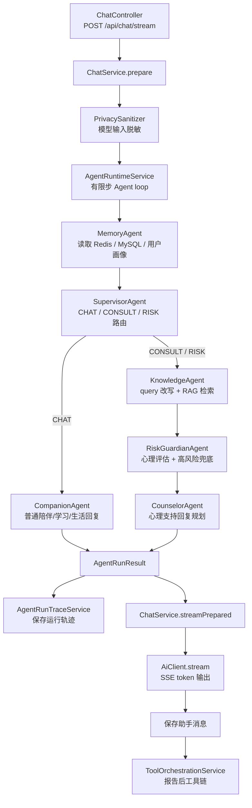
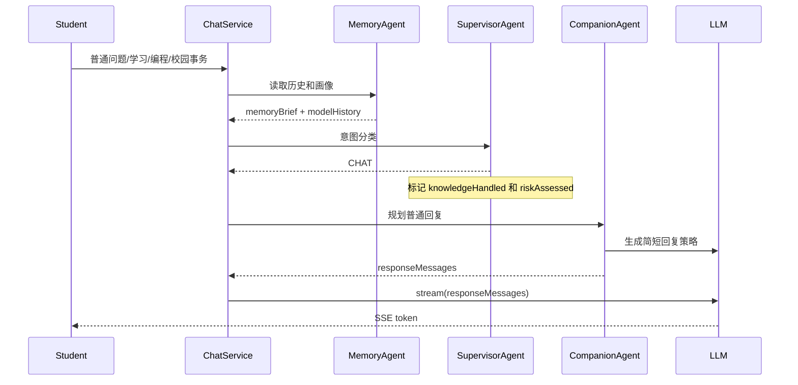
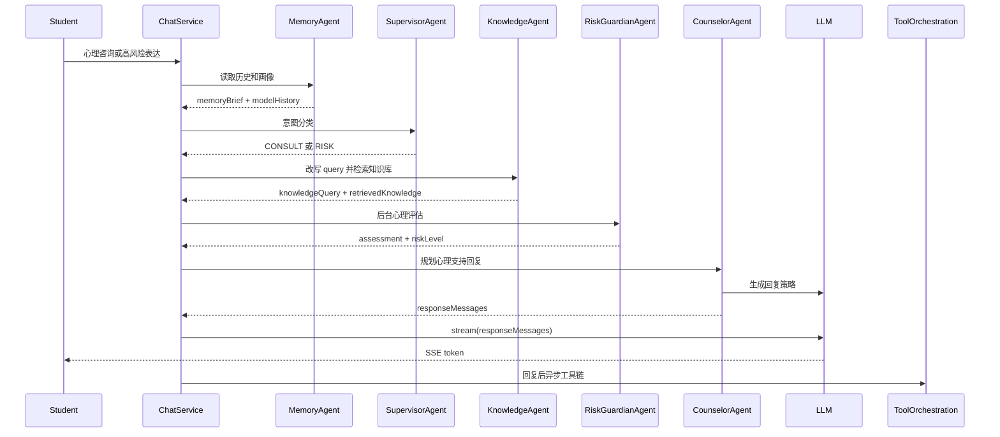

# MindBridge 多 Agent 协作技术文档

本文说明 MindBridge 项目中多 Agent 协作机制的设计目标、代码结构、运行流程、关键技术、数据流、可观测性和扩展方式。文档以当前仓库实现为准，主要涉及以下目录：

- `src/main/java/com/mindbridge/agent/service/agent/`
- `src/main/java/com/mindbridge/agent/service/`
- `src/main/java/com/mindbridge/agent/service/ai/`
- `src/main/java/com/mindbridge/agent/service/memory/`
- `src/main/java/com/mindbridge/agent/service/knowledge/`
- `src/main/java/com/mindbridge/agent/service/mcp/`
- `src/main/java/com/mindbridge/agent/domain/`
- `src/main/java/com/mindbridge/agent/controller/`
- `src/main/java/com/mindbridge/agent/config/`

## 1. 多 Agent 在项目中的定位

MindBridge 是一个面向学生的校园心理关怀系统。系统既要能处理普通聊天、学习和校园生活问题，也要能在心理咨询和高风险场景下提供更谨慎、更可控的回应。因此，项目没有把所有逻辑塞进一个“大而全”的 Prompt，而是采用多 Agent 协作，把一轮对话拆成多个职责清晰的专家步骤。

当前多 Agent 协作承担五类任务：

1. 记忆准备：读取短期聊天历史、长期用户画像，并提炼当前轮相关记忆。
2. 意图路由：判断本轮是普通聊天、心理咨询还是风险场景。
3. 知识检索：仅在咨询和风险场景下执行 RAG 检索。
4. 风险守护：用词库、模型结构化输出和关键词兜底生成后台心理评估。
5. 回复规划：根据不同路由，由普通陪伴 Agent 或心理支持 Agent 生成最终模型消息。

项目里的 Agent loop 是一个受控、有限步、状态驱动的协作流程，不是无限自主代理。它最多执行 8 步，每一步只能由一个 Agent 更新自己负责的上下文字段。这样的设计更适合心理安全场景：可预测、可追踪、可降级，也更容易在后台审计。

## 2. 总体架构



### 2.1 核心设计特点

- 单轮有限循环：`AgentRuntimeService.MAX_STEPS = 8`，避免无限循环和不可控自主行为。
- 固定优先级：Agent 顺序由构造函数中的 `List.of(...)` 固定。
- 状态驱动：每个 Agent 通过 `supports(AgentContext)` 判断自己是否接手。
- 共享上下文：所有 Agent 通过 `AgentContext` 传递输入、记忆、意图、检索结果、风险评估和回复计划。
- 结构化输出：每一步返回 `AgentDecision`，再转换为 `AgentStep`，最终持久化为 `AgentRunTrace`。
- 主流程与工具链分离：学生端回复完成后，报告写 Excel 和高风险预警异步执行，不阻塞聊天。

### 2.2 多 Agent 相关技术栈

| 层级 | 技术 | 在多 Agent 协作中的作用 |
| --- | --- | --- |
| 后端框架 | Java 17、Spring Boot 3.3.5 | 依赖注入、配置绑定、服务分层、事务管理 |
| 模型框架 | Spring AI 1.0.0 | 统一接入 Ollama 和 OpenAI 聊天模型 |
| 本地模型 | Ollama、`mindbridge-qwen2.5-7b-ft:latest` | 默认大模型 provider，负责分类、总结、评估、回复 |
| 云端模型 | OpenAI 兼容 Chat API | 可选替换 Ollama |
| 异步流式 | Spring WebFlux、Reactor、SSE | 最终回答以 token 流返回前端 |
| 短期记忆 | Redis、Spring Data Redis | 保存最近 N 轮上下文，供 MemoryAgent 快速读取 |
| 长期存储 | H2/MySQL、Spring Data JPA | 保存会话、消息、报告、用户画像和 Agent trace |
| RAG | Chroma、Embedding、BM25 | KnowledgeAgent 检索心理知识库 |
| 工具链 | Spring AI MCP、HTTP、SMTP、本地 Excel | 报告生成后的 Excel 写入和高风险预警 |
| 可观测性 | AgentRunTrace、AgentRunTraceStep | 管理员后台查看每轮 Agent 决策过程 |

## 3. 代码地图

| 模块 | 文件 | 作用 |
| --- | --- | --- |
| Agent 接口 | `MindBridgeAgent.java` | 定义 `name()`、`supports()`、`act()` 三个核心方法 |
| 运行时 | `AgentRuntimeService.java` | 按优先级选择下一步 Agent，执行最多 8 步 |
| 上下文 | `AgentContext.java` | 保存本轮对话所有中间状态和标记位 |
| 决策结果 | `AgentDecision.java` | 单个 Agent 执行后的动作、观察和是否完成 |
| 步骤轨迹 | `AgentStep.java` | 记录 step number、Agent 名称、动作、observation、时间 |
| 运行结果 | `AgentRunResult.java` | Agent loop 完成后返回给 ChatService 的结构化结果 |
| Agent 枚举 | `AgentName.java` | 当前 6 个内部 Agent 名称 |
| 动作枚举 | `AgentAction.java` | 当前 5 类 Agent 动作 |
| 记忆 Agent | `MemoryAgent.java` | 读取短期记忆、长期画像，生成 memoryBrief |
| 主控 Agent | `SupervisorAgent.java` | 调用 IntentClassifier 路由意图 |
| 知识 Agent | `KnowledgeAgent.java` | RAG query 改写、检索、充分性判断和二次检索 |
| 风险 Agent | `RiskGuardianAgent.java` | 调用心理评估服务并做高风险兜底 |
| 普通回复 Agent | `CompanionAgent.java` | 处理 CHAT 路由下的回复规划 |
| 心理支持 Agent | `CounselorAgent.java` | 处理 CONSULT/RISK 路由下的回复规划 |
| 主流程服务 | `ChatService.java` | 调用 Agent loop、保存 trace、流式输出、触发工具链 |
| 提示词模板 | `PromptTemplates.java` | 集中管理意图分类、心理评估、最终回答 prompt |
| 风险词库 | `RiskLexicon.java` | 高风险和咨询关键词硬规则 |
| 心理评估 | `PsychologicalAssessmentService.java` | 词库、模型 JSON、关键词启发式评估 |
| 运行轨迹 | `AgentRunTraceService.java` | 将 AgentRunResult 持久化并提供后台查询 |
| 后台工具 | `ToolOrchestrationService.java` | 报告后写 Excel，高风险再发送预警 |

## 4. Agent 抽象模型

### 4.1 MindBridgeAgent 接口

所有专家 Agent 都实现同一个接口：

```java
public interface MindBridgeAgent {
    AgentName name();
    boolean supports(AgentContext context);
    AgentDecision act(AgentContext context);
}
```

三个方法含义：

- `name()`：返回内部 Agent 名称，用于 trace 和后台展示。
- `supports(context)`：判断当前上下文状态是否轮到自己执行。
- `act(context)`：执行一步业务逻辑，更新 `AgentContext`，返回 `AgentDecision`。

这里的关键不是让每个 Agent 自由决策下一步，而是让运行时统一调度。Agent 只表达“我现在是否能处理”和“我处理后产生什么结果”。

### 4.2 AgentDecision

`AgentDecision` 是单步执行结果：

```java
public record AgentDecision(
        AgentAction action,
        String observation,
        boolean complete
) {
    public static AgentDecision continueWith(AgentAction action, String observation) { ... }
    public static AgentDecision finish(AgentAction action, String observation) { ... }
}
```

字段说明：

- `action`：这一步做了什么，比如 `READ_MEMORY`、`ROUTE_INTENT`。
- `observation`：执行摘要，用于排查和后台可视化。
- `complete`：是否结束本轮 Agent loop。

### 4.3 AgentStep

运行时会把每个 `AgentDecision` 转成 `AgentStep`：

```java
public record AgentStep(
        int step,
        AgentName agent,
        AgentAction action,
        String observation,
        Instant createdAt
) { ... }
```

`AgentStep` 是内存中的单步轨迹，稍后会被 `AgentRunTraceService` 转成 `AgentRunTraceStep` 实体持久化。

### 4.4 AgentRunResult

Agent loop 完成后，`AgentRunResult.from(context)` 从上下文中提取最终结果：

- `intent`
- `riskLevel`
- `assessment`
- `retrievedKnowledge`
- `modelHistory`
- `responseMessages`
- `memoryBrief`
- `knowledgeQuery`
- `responsePlan`
- `responseAgent`
- `steps`

它还提供：

```java
public boolean requiresReport() {
    return intent != null && intent != IntentType.CHAT && assessment != null;
}
```

这表示只有 `CONSULT` 和 `RISK` 且完成心理评估的对话才生成心理报告。普通 `CHAT` 不生成后台心理报告。

## 5. AgentContext 状态设计

`AgentContext` 是一轮对话内的共享黑板。每个 Agent 只写自己负责的字段，后续 Agent 根据这些字段和标记位决定是否执行。

### 5.1 输入字段

| 字段 | 含义 |
| --- | --- |
| `user` | 当前学生账号 |
| `session` | 当前聊天会话 |
| `originalInput` | 用户原始输入，用于落库和报告 |
| `modelInput` | 脱敏后的模型输入 |

`originalInput` 和 `modelInput` 分开，是为了兼顾审计和隐私。模型侧使用脱敏文本，数据库报告仍保留原始用户输入。

### 5.2 中间状态字段

| 字段 | 写入者 | 用途 |
| --- | --- | --- |
| `previousHistory` | MemoryAgent | 当前轮之前的历史消息 |
| `modelHistory` | MemoryAgent | 历史消息加当前用户输入，用于后续模型调用 |
| `memoryBrief` | MemoryAgent | 用户画像和最近对话摘要 |
| `intent` | SupervisorAgent | `CHAT / CONSULT / RISK` 路由结果 |
| `knowledgeQuery` | KnowledgeAgent | RAG 检索 query |
| `retrievedKnowledge` | KnowledgeAgent | RAG 检索结果 |
| `assessment` | RiskGuardianAgent | 后台心理评估结果 |
| `riskLevel` | RiskGuardianAgent 或 CompanionAgent | 风险等级 |
| `responsePlan` | CompanionAgent 或 CounselorAgent | 回复策略 |
| `responseMessages` | CompanionAgent 或 CounselorAgent | 最终传给模型的消息列表 |
| `responseAgent` | CompanionAgent 或 CounselorAgent | 最终负责回复的 Agent |
| `steps` | AgentRuntimeService | 本轮每一步执行轨迹 |

### 5.3 标记位

| 标记位 | 含义 |
| --- | --- |
| `memoryLoaded` | 是否完成记忆加载 |
| `intentRouted` | 是否完成意图路由 |
| `knowledgeHandled` | 是否完成知识处理。CHAT 会直接标记为完成 |
| `riskAssessed` | 是否完成风险评估。CHAT 会直接标记为完成 |
| `responsePlanned` | 是否完成回复规划 |
| `finished` | 本轮 loop 是否结束 |

这些标记位就是状态机的边。每个 Agent 执行后会设置对应标记，让运行时自然推进到下一步。

## 6. AgentRuntimeService 调度机制

`AgentRuntimeService` 中的 Agent 顺序是固定的：

```java
this.agents = List.of(
        memoryAgent,
        supervisorAgent,
        knowledgeAgent,
        riskGuardianAgent,
        companionAgent,
        counselorAgent);
```

执行逻辑：

```java
for (int step = 1; step <= MAX_STEPS && !context.finished(); step++) {
    MindBridgeAgent agent = nextAgent(context);
    AgentDecision decision = agent.act(context);
    context.addStep(AgentStep.of(step, agent.name(), decision));
    if (decision.complete()) {
        context.finish();
    }
}
```

`nextAgent(context)` 会从列表头部开始扫描，找到第一个 `supports(context) == true` 的 Agent。

这带来几个效果：

1. 优先级可控：Memory 永远先于 Supervisor，RiskGuardian 永远在 Knowledge 之后。
2. 分支清晰：CHAT 分支会跳过 Knowledge 和 RiskGuardian。
3. 易于扩展：新增 Agent 时，只要插入合适顺序并定义 supports 条件。
4. 可防护：如果没有 Agent 能处理当前状态，会抛出 `No agent can handle current context.`，避免静默失败。

## 7. 单轮对话完整生命周期

一轮学生消息从接口到最终工具链，大致分为 8 个阶段。

### 7.1 接口入口

入口在 `ChatController`：

```text
POST /api/chat/stream
produces: text/event-stream
```

控制器做两件事：

- 使用 Spring Security 的 `@AuthenticationPrincipal CurrentUser` 获取当前用户。
- 如果当前账号是管理员，直接返回 403。管理员只能看后台，不能以管理员身份发起学生对话。

### 7.2 输入脱敏与会话定位

`ChatService.prepare()` 中：

1. `request.message().trim()` 得到原始输入。
2. `PrivacySanitizer.sanitize(input)` 得到模型输入。
3. 根据 `sessionId` 找现有会话，或创建新会话。

脱敏规则包括：

- 手机号替换为 `[手机号]`
- 学号替换为 `[学号]`
- 身份证替换为 `[证件号]`
- “我叫某某”“我是某某”替换为 `[姓名]`

### 7.3 执行 Agent loop

```java
AgentRunResult agentRun = agentRuntimeService.run(user, session, input, modelInput);
```

此时多 Agent 完成记忆、路由、RAG、风险评估和回复规划。

### 7.4 保存用户消息与 Agent trace

Agent loop 完成后：

1. 保存用户消息到 `chat_messages`。
2. 调用 `agentRunTraceService.saveRun(...)` 保存运行轨迹。
3. 调用 `rememberUserProfile(...)` 尝试抽取用户画像长期记忆。

注意：当前实现是先运行 Agent，再保存本轮用户消息。因此 MemoryAgent 读取的是本轮之前的历史，然后自己把当前输入追加到 `modelHistory` 里供模型使用。

### 7.5 生成心理报告

如果 `agentRun.requiresReport()` 为 true：

- 创建 `PsychologicalReport`
- 保存原始输入、意图、情绪标签、情绪分数、风险等级、置信度、摘要

普通 `CHAT` 不生成报告。

### 7.6 组装模型消息

如果 Agent 已经生成 `responseMessages`，直接使用。否则走 `ChatService.buildMessages()` 兜底。

在当前实现中：

- `CompanionAgent` 会为 CHAT 生成 `responseMessages`。
- `CounselorAgent` 会为 CONSULT/RISK 生成 `responseMessages`。

### 7.7 SSE 流式回复

`ChatService.streamPrepared()` 返回三类事件：

- `meta`：先返回 `sessionId`。
- `token`：持续返回模型 token。
- `done`：本轮结束。

错误时返回：

- `error`

模型流式调用设置了 45 秒 timeout，避免前端长时间挂起。

### 7.8 回复后工具链

模型回复完成后：

1. 保存助手消息。
2. 如果本轮生成了心理报告，调用 `toolOrchestrationService.handleAsync(reportId)`。
3. 工具链在线程池中异步执行，不阻塞学生端聊天。

## 8. 分支流程

### 8.1 CHAT 分支



CHAT 分支特点：

- 不查 RAG。
- 不做心理评估。
- 不生成心理报告。
- 不触发 Excel/邮件工具链。
- 使用 `CompanionAgent` 回答普通学习、生活、校园事务、编程等问题。

### 8.2 CONSULT/RISK 分支



CONSULT/RISK 分支特点：

- 执行 RAG 检索。
- 执行心理风险评估。
- 生成心理报告。
- 高风险时写 Excel 成功后再发送预警。
- 最终回复由 `CounselorAgent` 控制，禁止向学生暴露后台标签和分数。

## 9. 各 Agent 详细说明

### 9.1 MemoryAgent

职责：

- 读取最近对话历史。
- 读取用户画像长期记忆。
- 将历史和画像总结成 `memoryBrief`。
- 构造包含当前输入的 `modelHistory`。

`supports()` 条件：

```java
return !context.memoryLoaded();
```

数据来源：

1. Redis 短期记忆：`ShortTermMemoryService.recent(sessionId)`
2. MySQL/H2 历史消息：Redis 空时读取 `ChatMessageRepository.findTop20BySession_IdOrderByCreatedAtDesc`
3. 用户画像：`UserProfileMemoryService.profileBrief(user, currentInput)`

执行细节：

- Redis 有数据时，直接用 Redis。
- Redis 没数据时，从数据库取最近 20 条消息，倒序恢复成时间正序，并刷新 Redis。
- `withCurrentUser(...)` 会把当前输入加入模型历史，并按 `CHAT_HISTORY_LIMIT * 2` 截断。
- `summarizeMemory(...)` 会调用模型从最近历史提取 1 到 3 条相关记忆。
- 模型调用失败时，返回“无相关历史记忆。”。

输出：

- `previousHistory`
- `modelHistory`
- `memoryBrief`
- `memoryLoaded = true`
- `AgentAction.READ_MEMORY`

observation 示例：

```text
Redis loaded 6 messages; memory brief prepared
MySQL loaded 12 messages; memory brief prepared
```

### 9.2 SupervisorAgent

职责：

- 将本轮输入路由到 `CHAT / CONSULT / RISK`。
- 对 CHAT 分支提前标记知识和风险处理完成，跳过心理链路。

`supports()` 条件：

```java
return context.memoryLoaded() && !context.intentRouted();
```

核心调用：

```java
IntentType intent = intentClassifier.classify(context.modelInput(), context.modelHistory());
```

`IntentClassifier` 的路由策略：

1. 高风险词库优先：命中 `RiskLexicon.hasHighRiskSignal` 直接返回 `RISK`。
2. 普通任务词优先：学习、编程、项目、作业等明确普通任务，在没有咨询词时直接返回 `CHAT`。
3. 模型分类：调用 `PromptTemplates.intentPrompt(...)`，要求只输出 `CHAT / CONSULT / RISK`。
4. 兜底规则：模型失败时，根据咨询词库或最近咨询上下文返回 `CONSULT`，否则返回 `CHAT`。

输出：

- `intent`
- `intentRouted = true`
- 如果是 CHAT：`knowledgeHandled = true`，`riskAssessed = true`
- `AgentAction.ROUTE_INTENT`

observation 示例：

```text
intent=CHAT
intent=CONSULT
intent=RISK
```

### 9.3 KnowledgeAgent

职责：

- 只在 `CONSULT/RISK` 分支执行。
- 将学生输入和记忆摘要改写成适合心理知识库的检索 query。
- 调用 `KnowledgeService.retrieve(...)` 执行 RAG。
- 判断检索结果是否足够，必要时二次检索。

`supports()` 条件：

```java
return context.intentRouted()
        && !context.knowledgeHandled()
        && context.intent() != IntentType.CHAT;
```

执行步骤：

1. `rewriteQuery(context)`：模型把输入改写成不超过 40 字的中文 query。
2. `knowledgeService.retrieve(query, topK)`：执行 Chroma/embedding/BM25 混合检索。
3. `isKnowledgeEnough(context, retrieved)`：模型判断检索结果是否足够。
4. 如果不足，`refineQuery(...)` 生成更具体 query。
5. refined query 不同且检索不为空时，替换原结果。

降级策略：

- query 改写失败：直接使用 `context.modelInput()`。
- 充分性判断失败：默认认为足够，避免模型异常导致额外阻塞。
- 二次 query 失败：保留原 query。

输出：

- `knowledgeQuery`
- `retrievedKnowledge`
- `knowledgeHandled = true`
- `AgentAction.RETRIEVE_KNOWLEDGE`

observation 示例：

```text
query=焦虑 心慌 稳定情绪; retrieved=4
query=危机安全计划 自伤 即时危险; refined=true; retrieved=4
```

### 9.4 RiskGuardianAgent

职责：

- 只在咨询和风险链路执行。
- 生成后台心理评估。
- 对已经路由为 RISK 的输入做高风险硬兜底。

`supports()` 条件：

```java
return context.knowledgeHandled()
        && !context.riskAssessed()
        && context.intent() != IntentType.CHAT;
```

核心调用：

```java
PsychologyAssessment assessment =
        assessmentService.assess(context.modelInput(), context.modelHistory());
```

`PsychologicalAssessmentService` 的评估策略：

1. 高风险词库硬规则：明确自伤/伤人信号直接 HIGH。
2. 模型结构化 JSON：要求输出 emotion、emotionScore、risk、confidence、summary。
3. JSON 解析兼容：如果模型在 JSON 前后加文本，只截取最外层 `{...}`。
4. 风险归一化：取模型 risk 和 emotionScore 推导等级中更高的一方。
5. 关键词启发式兜底：模型失败时用低落、焦虑、失眠等关键词推断。

RiskGuardian 额外兜底：

```java
if (context.intent() == IntentType.RISK && assessment.risk() != RiskLevel.HIGH) {
    assessment = new PsychologyAssessment(..., RiskLevel.HIGH, ...);
}
```

输出：

- `assessment`
- `riskLevel`
- `riskAssessed = true`
- `AgentAction.ASSESS_RISK`

observation 示例：

```text
risk=HIGH, emotion=HIGH_RISK
risk=MEDIUM, emotion=DEPRESSED
risk=LOW, emotion=ANXIETY
```

### 9.5 CompanionAgent

职责：

- 只处理 CHAT。
- 生成普通陪伴、学习、生活、校园事务、编程等回复的策略和模型消息。
- 明确不做心理评估，不生成报告。

`supports()` 条件：

```java
return context.intentRouted()
        && context.intent() == IntentType.CHAT
        && !context.responsePlanned();
```

执行步骤：

1. 设置 `riskLevel = LOW`。
2. 设置 `responseAgent = COMPANION_AGENT`。
3. 调用模型生成一句简短回复策略。
4. 使用 `PromptTemplates.answerSystemPrompt(CHAT, LOW, "", displayName)` 构造系统 prompt。
5. 附加“当前由 CompanionAgent 负责回复”的 system message。
6. 附加 `modelHistory`。
7. 标记 `responsePlanned = true`。
8. 返回 `AgentDecision.finish(...)` 结束本轮 loop。

降级策略：

- 策略生成失败时，使用“围绕用户当前问题直接、自然地回答。”。

输出：

- `responseAgent`
- `responsePlan`
- `responseMessages`
- `responsePlanned = true`
- `AgentAction.PLAN_RESPONSE`
- `complete = true`

### 9.6 CounselorAgent

职责：

- 处理 CONSULT 和 RISK。
- 结合记忆、RAG、风险评估生成心理支持回复策略。
- 构造最终给模型流式生成的消息列表。

`supports()` 条件：

```java
return context.riskAssessed()
        && context.intent() != IntentType.CHAT
        && !context.responsePlanned();
```

执行步骤：

1. 设置 `responseAgent = COUNSELOR_AGENT`。
2. 调用模型制定 2 到 3 句回复策略。
3. 策略输入包括：
   - 记忆摘要
   - 当前输入
   - 风险守护结果摘要
   - 知识库 query
   - 知识库命中
4. 将检索结果格式化为：

```text
- [source] content
```

5. 调用 `PromptTemplates.answerSystemPrompt(intent, riskLevel, knowledgeContext, displayName)` 构造心理支持 system prompt。
6. 附加 CounselorAgent 的 system message，包含记忆、query、回复策略。
7. 附加 `modelHistory`。
8. 标记 `responsePlanned = true`。
9. 返回 `AgentDecision.finish(...)` 结束本轮 loop。

降级策略：

- 策略生成失败时，使用“先共情，再给出具体支持步骤；高风险时优先安全。”。

输出：

- `responseAgent`
- `responsePlan`
- `responseMessages`
- `responsePlanned = true`
- `AgentAction.PLAN_RESPONSE`
- `complete = true`

## 10. Prompt 协作设计

项目把 Prompt 集中放在 `PromptTemplates`，避免散落在多个服务里。

### 10.1 意图分类 Prompt

用于 `SupervisorAgent`，要求模型只输出一个标签：

- `CHAT`
- `CONSULT`
- `RISK`

关键约束：

- 当前输入权重最高。
- 普通学习、编程、考试、室友、关系等，如果没有明显心理痛苦或危险信号，一律归为 CHAT。
- 分类器只做意图识别，不回答问题。

### 10.2 心理评估 Prompt

用于 `RiskGuardianAgent` 背后的 `PsychologicalAssessmentService`，要求严格 JSON：

```json
{
  "emotion": "NORMAL|ANXIETY|DEPRESSED|HIGH_RISK",
  "emotionScore": 0.0,
  "risk": "LOW|MEDIUM|HIGH",
  "confidence": 0.0,
  "summary": "short reason"
}
```

这个 JSON 不是给学生看的，而是写报告和工具链使用。

### 10.3 CHAT 回答 Prompt

用于 `CompanionAgent` 的最终回复：

- 不主动做心理测评。
- 不输出风险等级、心理标签、诊断结论或报告口吻。
- 普通问题直接回答。
- 不把普通聊天强行引导成心理咨询。

### 10.4 CONSULT/RISK 回答 Prompt

用于 `CounselorAgent` 的最终回复：

- 共情、谨慎、非评判。
- 不诊断疾病、不开药、不替代持证心理咨询师。
- 优先基于检索知识回答。
- 知识不足时明确说明，不编造流程或数据。
- 不向学生输出风险等级、心理报告、评估分数或后台判断标签。

高风险时额外加入：

- 先回应情绪，再关注当前安全。
- 鼓励联系可信任的人、辅导员、心理中心或当地紧急救助。
- 不提供危险操作细节。
- 给出马上可执行的安全步骤。

## 11. 模型调用方式

项目内部只依赖 `AiClient`：

```java
public interface AiClient {
    String complete(List<AiMessage> messages);
    Flux<String> stream(List<AiMessage> messages);
}
```

两种调用方式分工明确：

- `complete(...)`：用于中间 Agent 决策，包括记忆摘要、意图分类、query 改写、充分性判断、心理评估、回复策略规划。
- `stream(...)`：只用于最终学生回复，保证前端有打字机式体验。

`SpringAiChatClient` 将项目内部 `AiMessage` 转换为 Spring AI 的：

- `SystemMessage`
- `UserMessage`
- `AssistantMessage`

模型 provider 由 `AiClientConfig` 选择：

- `AI_PROVIDER=ollama`：使用 `OllamaChatModel`
- `AI_PROVIDER=openai`：使用 `OpenAiChatModel`

默认 Ollama 参数：

- `temperature`: 来自 `AI_TEMPERATURE`，默认 0.35
- `numPredict`: 来自 `AI_MAX_TOKENS`，默认 512
- `topP`: 0.85
- `repeatPenalty`: 1.12

## 12. 记忆系统与 Agent 协作

多 Agent 协作中的记忆分三层。

### 12.1 短期记忆

`ShortTermMemoryService` 使用 Redis list：

```text
mindbridge:chat:short-memory:{sessionId}
```

每次保存消息时：

1. `rightPush` 新消息。
2. `trim` 到最近 `CHAT_HISTORY_LIMIT * 2` 条。
3. 设置 TTL，默认 `CHAT_SHORT_MEMORY_TTL_HOURS=24`。

Redis 失败时会记录 debug 日志并跳过，不影响聊天主流程。

### 12.2 数据库历史

如果 Redis 没有短期记忆，MemoryAgent 从数据库读取最近 20 条消息：

```java
findTop20BySession_IdOrderByCreatedAtDesc(sessionId)
```

再反转为时间正序，并刷新 Redis。

### 12.3 用户画像长期记忆

`UserProfileMemoryService` 从学生输入中抽取长期稳定信息：

- 偏好
- 沟通方式
- 支持需求
- 个人背景
- 状态模式

约束：

- 不保存诊断结论。
- 不保存风险等级。
- 不保存手机号、学号、证件号、真实姓名、详细地址。
- 置信度低于 0.55 不保存。
- 每个用户最多保留 40 条。

画像可以镜像到 Chroma，用当前输入做语义召回。如果 Chroma 不可用，则回退到最近更新的 12 条。

### 12.4 memoryBrief 的作用

`memoryBrief` 会被多个 Agent 使用：

- KnowledgeAgent：帮助改写 RAG query。
- CompanionAgent：让普通回复更贴近用户上下文。
- CounselorAgent：制定心理支持策略时考虑用户历史和支持需求。

## 13. RAG 与多 Agent 的关系

RAG 并不是全局默认执行，而是由 Supervisor 路由后才进入 KnowledgeAgent。

### 13.1 为什么不对所有消息 RAG

如果所有消息都触发心理知识库，普通学习和生活问题会被过度心理化。例如“帮我解释 Java 接口”不应该进入心理评估、报告和 RAG。

因此，项目中：

- CHAT：跳过 KnowledgeAgent 和 RiskGuardianAgent。
- CONSULT/RISK：进入 KnowledgeAgent 和 RiskGuardianAgent。

### 13.2 KnowledgeAgent 输出如何影响 CounselorAgent

KnowledgeAgent 写入：

- `knowledgeQuery`
- `retrievedKnowledge`

CounselorAgent 会将检索结果拼成 `knowledgeContext`，交给 `PromptTemplates.answerSystemPrompt(...)`。

心理支持 prompt 明确要求：

- 优先基于检索知识回答。
- 知识不足时明确说明。
- 不编造心理术语、流程或数据。

## 14. 风险守护与报告链路

风险处理分两部分：

1. 对话内：RiskGuardianAgent 生成 `PsychologyAssessment`，影响 CounselorAgent 的回复策略。
2. 对话后：ChatService 根据 `AgentRunResult.requiresReport()` 写心理报告，再由 ToolOrchestrationService 执行工具链。

### 14.1 心理评估对象

`PsychologyAssessment` 包含：

| 字段 | 含义 |
| --- | --- |
| `emotion` | `NORMAL / ANXIETY / DEPRESSED / HIGH_RISK` |
| `emotionScore` | 情绪分数 |
| `risk` | `LOW / MEDIUM / HIGH` |
| `confidence` | 置信度 |
| `summary` | 后台判断摘要 |

该对象只用于服务端报告和工具链，不作为学生端消息内容。

### 14.2 心理报告生成

如果 intent 不是 CHAT 且 assessment 不为空，`ChatService.saveReport(...)` 保存：

- user
- session
- 原始 content
- intent
- emotion
- emotionScore
- riskLevel
- confidence
- summary

### 14.3 工具链触发

工具链在模型回复完成后异步执行：

```java
if (prepared.reportId() != null) {
    toolOrchestrationService.handleAsync(prepared.reportId());
}
```

执行顺序：

1. 写 Excel。
2. 只有 Excel 写入成功且 `riskLevel == HIGH`，才发送预警。
3. 每个收件人独立重试和落库。
4. 更新报告中的 Excel 和 Email 状态。

这种顺序保证高风险预警建立在报告归档成功之后。

## 15. MCP 与外部工具协作

项目支持多种工具模式，配置在 `McpToolConfig`：

### 15.1 Excel 写入模式

| 模式 | 实现 | 说明 |
| --- | --- | --- |
| `local` | `LocalExcelReportWriter` | 默认写入本地 `./data/mindbridge-reports.xlsx` |
| `http` | `HttpExcelReportWriter` | 调用外部 HTTP 服务 |
| `mcp` | `McpExcelReportWriter` | 通过 Spring AI MCP Client 调用工具 |

### 15.2 邮件预警模式

| 模式 | 实现 | 说明 |
| --- | --- | --- |
| `log` | `LogAlertNotifier` | 默认只记录日志 |
| `smtp` | `SmtpAlertNotifier` | 使用 Spring Mail |
| `http` | `HttpAlertNotifier` | 调用外部 HTTP 服务 |
| `mcp` | `McpAlertNotifier` | 通过 Spring AI MCP Client 调用工具 |

### 15.3 MCP 工具暴露

`MindBridgeMcpTools` 暴露两个工具：

- `mindbridge_write_excel_report`
- `mindbridge_send_risk_alert`

它们通过 `@Tool` 和 `@ToolParam` 注解注册为 Spring AI 工具。`McpToolClient` 会从 `SyncMcpToolCallbackProvider` 查找工具并以 JSON 参数调用。

### 15.4 独立线程池

工具链使用独立线程池：

```java
ThreadPoolTaskExecutor
corePoolSize = 2
maxPoolSize = 6
queueCapacity = 200
threadNamePrefix = "mindbridge-mcp-"
```

这避免后台 Excel/邮件/MCP 调用阻塞学生端聊天。

## 16. Agent Trace 可观测性

每轮 Agent loop 都会被保存为 `AgentRunTrace`。

### 16.1 主表

`agent_run_traces` 保存：

- `traceId`
- `session`
- `user`
- `triggerMessage`
- `input`
- `intent`
- `riskLevel`
- `memoryBrief`
- `knowledgeQuery`
- `responsePlan`
- `responseAgent`
- `stepCount`
- `startedAt`
- `completedAt`

索引：

- session
- user
- startedAt

### 16.2 步骤表

`agent_run_trace_steps` 保存：

- `trace`
- `stepNumber`
- `agent`
- `action`
- `observation`
- `createdAt`

索引：

- `trace_id, step_number`

### 16.3 后台查询接口

`ReportController` 提供：

```text
GET /api/admin/run-traces
GET /api/admin/run-traces/{traceId}
GET /api/admin/conversations/{sessionId}/run-traces
```

这些接口让管理员能够回看：

- 本轮为什么被判为 CONSULT 或 RISK。
- RAG query 是什么。
- 检索是否发生。
- 风险等级如何得出。
- 最终哪个 Agent 负责回复。
- 每一步 Agent 的 observation。

## 17. 配置项

### 17.1 模型配置

| 环境变量 | 默认值 | 说明 |
| --- | --- | --- |
| `AI_PROVIDER` | `ollama` | 模型 provider，支持 `ollama` 或 `openai` |
| `AI_TEMPERATURE` | `0.35` | 生成温度 |
| `AI_MAX_TOKENS` | `512` | 最大生成 token |
| `OLLAMA_BASE_URL` | `http://localhost:11434` | Ollama 地址 |
| `OLLAMA_MODEL` | `mindbridge-qwen2.5-7b-ft:latest` | 本地项目模型 |
| `OPENAI_BASE_URL` | `https://api.openai.com` | OpenAI 兼容接口 |
| `OPENAI_API_KEY` | 空 | OpenAI key |
| `OPENAI_MODEL` | `gpt-4o-mini` | OpenAI 聊天模型 |

### 17.2 记忆配置

| 环境变量 | 默认值 | 说明 |
| --- | --- | --- |
| `CHAT_HISTORY_LIMIT` | `10` | 保留给模型的历史轮次数 |
| `CHAT_SHORT_MEMORY_TTL_HOURS` | `24` | Redis 短期记忆 TTL |
| `MEMORY_USE_CHROMA` | `${USE_CHROMA:true}` | 是否启用画像语义召回 |
| `MEMORY_TOP_K` | `6` | 每轮召回画像数量 |

### 17.3 RAG 配置

| 环境变量 | 默认值 | 说明 |
| --- | --- | --- |
| `RAG_TOP_K` | `4` | KnowledgeAgent 检索结果数量 |
| `USE_CHROMA` | `true` | 是否启用 Chroma |
| `CHROMA_COLLECTION` | `mindbridge_knowledge` | 知识库 collection |
| `KNOWLEDGE_CHUNK_SIZE` | `512` | 知识切块大小 |
| `KNOWLEDGE_CHUNK_OVERLAP` | `64` | 切块 overlap |

### 17.4 工具链配置

| 环境变量 | 默认值 | 说明 |
| --- | --- | --- |
| `MCP_EXCEL_MODE` | `local` | Excel 写入模式：`local/http/mcp` |
| `MCP_EXCEL_LOCAL_PATH` | `./data/mindbridge-reports.xlsx` | 本地 Excel 路径 |
| `MCP_EMAIL_MODE` | `log` | 邮件模式：`log/smtp/http/mcp` |
| `ALERT_MAIL_RECIPIENTS` | `counselor-alerts@example.com` | 预警收件人 |
| `ALERT_MAIL_MAX_RETRIES` | `2` | 邮件最大重试次数 |
| `MCP_CLIENT_ENABLED` | `false` | 是否启用 MCP Client |
| `MCP_SERVER_ENABLED` | `true` | 是否启用 MCP Server |

## 18. 典型运行样例

### 18.1 普通学习问题

输入：

```text
帮我解释一下 Java interface 是什么
```

预期 Agent steps：

| step | Agent | Action | 说明 |
| --- | --- | --- | --- |
| 1 | `MEMORY_AGENT` | `READ_MEMORY` | 读取历史和画像 |
| 2 | `SUPERVISOR_AGENT` | `ROUTE_INTENT` | 判为 `CHAT` |
| 3 | `COMPANION_AGENT` | `PLAN_RESPONSE` | 规划普通学习回复并结束 |

不会执行：

- `KNOWLEDGE_AGENT`
- `RISK_GUARDIAN_AGENT`
- `COUNSELOR_AGENT`
- 心理报告
- Excel/邮件工具链

### 18.2 心理咨询问题

输入：

```text
我最近焦虑到心慌，晚上也睡不着
```

预期 Agent steps：

| step | Agent | Action | 说明 |
| --- | --- | --- | --- |
| 1 | `MEMORY_AGENT` | `READ_MEMORY` | 读取历史和画像 |
| 2 | `SUPERVISOR_AGENT` | `ROUTE_INTENT` | 判为 `CONSULT` |
| 3 | `KNOWLEDGE_AGENT` | `RETRIEVE_KNOWLEDGE` | 检索焦虑、睡眠、稳定情绪相关知识 |
| 4 | `RISK_GUARDIAN_AGENT` | `ASSESS_RISK` | 生成后台心理评估 |
| 5 | `COUNSELOR_AGENT` | `PLAN_RESPONSE` | 结合 RAG 和风险结果规划心理支持回复 |

会生成心理报告，但通常不会发送高风险预警。

### 18.3 高风险表达

输入：

```text
我不想活了，今晚可能会伤害自己
```

预期 Agent steps：

| step | Agent | Action | 说明 |
| --- | --- | --- | --- |
| 1 | `MEMORY_AGENT` | `READ_MEMORY` | 读取上下文 |
| 2 | `SUPERVISOR_AGENT` | `ROUTE_INTENT` | 高风险词库命中，判为 `RISK` |
| 3 | `KNOWLEDGE_AGENT` | `RETRIEVE_KNOWLEDGE` | 检索危机安全计划、风险处理规则 |
| 4 | `RISK_GUARDIAN_AGENT` | `ASSESS_RISK` | 强制确保风险为 `HIGH` |
| 5 | `COUNSELOR_AGENT` | `PLAN_RESPONSE` | 高风险安全优先回复 |

回复完成后：

1. 写心理报告。
2. 写 Excel。
3. Excel 成功后发送预警。

## 19. 和单 Agent / 普通 Chain 的区别

MindBridge 当前实现更接近“受控多 Agent 工作流”，不是完全开放式 Auto Agent。

| 对比项 | 单 Prompt | 普通 Chain | MindBridge 多 Agent |
| --- | --- | --- | --- |
| 职责划分 | 全部压在一个 prompt | 顺序固定但模块可能较粗 | 每个 Agent 单一职责 |
| 分支控制 | 模型自由决定 | 代码固定分支 | Supervisor 路由 + supports 状态机 |
| 安全兜底 | 主要靠 prompt | 可加规则 | 词库、路由、风险评估、prompt、工具链多层兜底 |
| 可观测性 | 通常只有最终回复 | 可记录链路 | 每步 Agent、action、observation 落库 |
| 是否无限自主 | 否 | 否 | 否，最多 8 步 |
| 适合场景 | 简单问答 | 固定流程 | 心理关怀这种需要动态路由和审计的场景 |

## 20. 扩展一个新 Agent 的方式

如果要新增 Agent，例如 `SafetyReviewAgent`，建议按以下步骤：

1. 新增枚举值：

```java
public enum AgentName {
    ...
    SAFETY_REVIEW_AGENT
}
```

2. 如果需要新动作，新增 `AgentAction`：

```java
SAFETY_REVIEW
```

3. 实现 `MindBridgeAgent`：

```java
@Component
public class SafetyReviewAgent implements MindBridgeAgent {
    @Override
    public AgentName name() { return AgentName.SAFETY_REVIEW_AGENT; }

    @Override
    public boolean supports(AgentContext context) {
        return context.responsePlanned() && !context.finished();
    }

    @Override
    public AgentDecision act(AgentContext context) {
        // 更新 context 中自己负责的字段
        return AgentDecision.finish(AgentAction.SAFETY_REVIEW, "safety reviewed");
    }
}
```

4. 在 `AgentRuntimeService` 构造函数中注入并插入合适顺序。
5. 如果新增状态字段，扩展 `AgentContext`、`AgentRunResult` 和 `AgentRunTrace`。
6. 更新后台 DTO，让 trace 能展示新增字段。
7. 增加测试样例，覆盖该 Agent 的 supports 条件和分支效果。

扩展时最重要的是：不要让新 Agent 同时负责多个阶段，也不要让多个 Agent 在同一状态下都能抢占执行，除非你明确调整了优先级。

## 21. 排障指南

### 21.1 普通问题误触发心理链路

检查：

- `AgentRunTrace.intent` 是否为 `CONSULT` 或 `RISK`。
- 输入是否命中了 `RiskLexicon.CONSULT_WORDS`。
- 最近 6 条历史中是否有咨询语境，导致 `hasRecentConsultContext` 返回 true。
- `PromptTemplates.intentPrompt` 是否让模型过度敏感。

### 21.2 心理求助没有触发 RAG

检查：

- `SupervisorAgent` 是否判为 `CHAT`。
- 输入是否被普通任务词覆盖。
- `RiskLexicon.hasConsultSignal` 是否缺少关键词。
- Agent trace 中是否出现 `KNOWLEDGE_AGENT`。

### 21.3 高风险没有发预警

检查：

- `AgentRunTrace.riskLevel` 是否为 `HIGH`。
- 是否生成了 `PsychologicalReport`。
- `report.excelStatus` 是否为 `SUCCESS`。
- `ToolOrchestrationService` 只有 Excel 成功且 HIGH 才发预警。
- `MCP_EMAIL_MODE`、SMTP 或 MCP Client 配置是否正确。
- `AlertRecord` 中每个收件人的状态和错误信息。

### 21.4 前端没有收到回复

检查：

- SSE 是否返回了 `meta`。
- 模型是否在 45 秒内返回 token。
- `AiClient.stream(...)` 是否为空。
- 是否返回了 `error` 事件。
- Ollama 或 OpenAI provider 是否可用。

### 21.5 Agent loop 抛出 No agent can handle

说明当前 `AgentContext` 的标记位进入了没有任何 Agent 支持的状态。检查：

- 是否新增了 Agent 状态字段但没有更新 supports 条件。
- 某个 Agent 是否忘记 `mark...`。
- 某个分支是否没有最终 `PLAN_RESPONSE`。
- `AgentRuntimeService` 中的 Agent 顺序是否改变。

## 22. 当前实现边界

1. Agent 顺序是硬编码的，适合当前规模，但未来复杂后可以抽象为显式状态机配置。
2. 中间 Agent 的模型调用是同步 `complete()`，复杂对话下准备阶段可能耗时。
3. `AgentContext` 是内存对象，只在本轮有效，跨轮依赖 Redis、数据库和用户画像。
4. `AgentRunTrace` 保存了 query 和 plan，但没有保存完整 prompt 和完整 RAG score。
5. `RiskLexicon` 是静态词表，后续可引入配置化词库或更细粒度的安全分类器。
6. 用户画像抽取在回复前后与主流程耦合较近，未来可异步化。
7. ToolOrchestration 是回复后工具链，不参与当前轮模型决策；如果未来需要工具调用反哺回复，需要设计新的 Agent。

## 23. 后续优化建议

推荐演进方向：

1. 为 Agent loop 增加单元测试，覆盖 CHAT、CONSULT、RISK 三条主分支。
2. 在后台 trace 中展示每步耗时，定位慢 Agent。
3. 为 `AgentContext` 增加显式状态枚举，减少多个 boolean 标记组合带来的维护成本。
4. 将 `RiskLexicon` 配置化，支持后台维护高风险词和咨询词。
5. 对 `IntentClassifier` 增加更多误判样本，持续优化普通问题和心理咨询的边界。
6. 将用户画像抽取改为异步任务，降低聊天准备阶段耗时。
7. 在 trace 中保存 RAG source、score、topK 和 refined query，便于检索质量排障。
8. 为高风险链路增加人工确认状态，形成辅导员处置闭环。

## 24. 一句话总结

MindBridge 的多 Agent 协作是一个面向心理安全场景的受控工作流：它用 MemoryAgent 准备上下文，用 SupervisorAgent 做路由，用 KnowledgeAgent 提供 RAG 依据，用 RiskGuardianAgent 做安全评估，再由 CompanionAgent 或 CounselorAgent 生成最终回复。整个流程通过 `AgentContext` 共享状态、通过 `AgentRunTrace` 落库审计、通过 SSE 提供流式体验，并在回复后用工具链完成报告归档和高风险预警。
