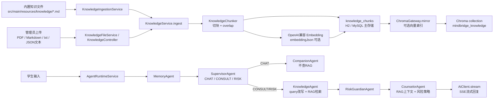
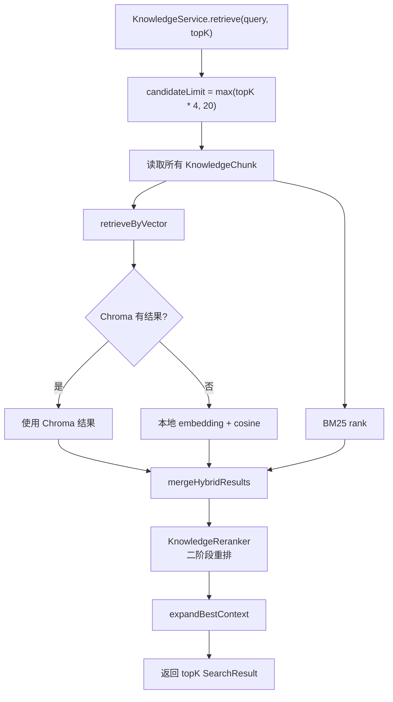

# 

## 1. RAG 在项目中的定位

RAG 是 Retrieval-Augmented Generation，即检索增强生成。它的核心思想是：模型生成回答前，先从可控知识库中检索和当前问题相关的资料，再把这些资料作为上下文交给模型生成回答。

在 MindBridge 中，RAG 不只是一个“向量库查询”功能，而是被放进校园心理关怀的多 Agent 流程里，承担三个目标：

1. 降低幻觉：心理支持、校园求助流程、危机安全建议等内容优先来自项目内置或管理员维护的知识库。
2. 控制边界：普通聊天、学习、编程、校园事务不触发心理 RAG，避免把正常问题过度心理化。
3. 提升安全性：风险场景中，RAG 和 RiskGuardian 的风险评估共同约束回复，模型不能直接输出后台风险等级、诊断结论或危险细节。

项目中的 RAG 有两类语义检索能力：

- 知识库 RAG：面向心理支持知识、校园资源、风险策略等文档，服务最终回答生成。
- 用户画像语义召回：面向用户长期偏好和支持需求，辅助 MemoryAgent 生成记忆摘要。它不直接替代知识库 RAG，但会影响 query 改写和回复策略。

本文重点讲知识库 RAG，同时单独说明用户画像召回与它的关系。

## 2. 总体架构

MindBridge 的 RAG 采用“数据库主存储 + 可选 Chroma 向量索引 + BM25 本地兜底 + Agent 路由”的架构。



### 2.1 关键设计点

- 路由优先：`SupervisorAgent` 先判断 `CHAT / CONSULT / RISK`。只有 `CONSULT` 和 `RISK` 触发 `KnowledgeAgent`。
- 数据库是主存储：知识切块统一保存到 `knowledge_chunks` 表。Chroma 只是可选索引层，不是唯一数据源。
- 检索是混合式：优先查 Chroma 或本地向量，再同时跑 BM25，最后按加权分数融合。
- 失败可降级：Chroma 不可用、embedding API 未配置或调用失败时，系统仍可通过 BM25 检索工作。
- 回答受约束：检索结果只作为 system prompt 上下文输入给模型，用户不会看到后台分数、风险标签或报告信息。

### 2.2 RAG 相关技术栈

| 层级 | 技术 | 在 RAG 中的作用 |
| --- | --- | --- |
| 后端框架 | Java 17、Spring Boot 3.3.5 | 提供服务启动、配置绑定、依赖注入、事务和 REST 接口 |
| 模型接入 | Spring AI 1.0.0、Ollama、OpenAI 兼容接口 | 接入本地 Qwen/Ollama 生成模型，也可切换 OpenAI provider |
| 流式输出 | Spring WebFlux、Reactor、SSE | 将最终模型回答以 token 流返回前端 |
| 主存储 | H2、MySQL、Spring Data JPA | 保存知识切块、embeddingJson、会话、报告和 Agent trace |
| 短期记忆 | Redis、Spring Data Redis | 保存最近对话，辅助 MemoryAgent 准备上下文 |
| 向量索引 | Chroma | 可选保存知识库和用户画像的语义索引 |
| 向量化 | OpenAI 兼容 `/v1/embeddings` | 生成本地 `embeddingJson`，用于本地向量相似度兜底 |
| 关键词检索 | 自研 BM25 | 无 embedding 或 Chroma 不可用时仍可检索知识 |
| 文件解析 | Apache PDFBox | 从管理员上传的 PDF 中抽取文本 |
| 质量评测 | RAGAS、LangChain OpenAI/Ollama wrappers | 离线评测上下文精确率、召回、忠实度和回答相关性 |

## 3. 代码地图

| 模块 | 文件 | 职责 |
| --- | --- | --- |
| 知识切块实体 | `domain/KnowledgeChunk.java` | 保存 source、sourceIndex、content、embeddingJson 和 createdAt |
| 知识库仓储 | `repository/KnowledgeChunkRepository.java` | 按 source 删除、计数、按 sourceIndex 取邻居切块 |
| 入库核心 | `service/knowledge/KnowledgeService.java` | 切块、embedding、落库、Chroma 镜像、混合检索、上下文扩展 |
| 切块器 | `service/knowledge/KnowledgeChunker.java` | 按自然边界和 overlap 切分文本 |
| BM25 检索 | `service/knowledge/Bm25Scorer.java` | 本地关键词检索和中文 bigram tokenizer |
| Chroma 网关 | `service/knowledge/ChromaGateway.java` | 创建 collection、写入、查询、按 source 删除 |
| Embedding 接口 | `service/knowledge/EmbeddingClient.java` | 抽象文本向量化能力 |
| OpenAI embedding | `service/knowledge/OpenAiEmbeddingClient.java` | 调用 OpenAI 兼容 `/v1/embeddings` 接口 |
| 内置知识同步 | `service/knowledge/KnowledgeIngestionService.java` | 启动时加载 `classpath*:knowledge/*.*` |
| 文件解析 | `service/knowledge/KnowledgeFileService.java` | 支持 PDF、Markdown、txt，限制 10MB |
| 管理接口 | `controller/KnowledgeController.java` | `POST /api/admin/knowledge` 和 `/file` |
| RAG Agent | `service/agent/KnowledgeAgent.java` | query 改写、检索、充分性判断、二次检索 |
| 回复 Agent | `service/agent/CounselorAgent.java` | 将 RAG 命中、风险评估和记忆摘要组合进回复 prompt |
| Prompt 模板 | `service/ai/PromptTemplates.java` | 控制回答边界、知识注入和高风险规则 |
| RAG 评测 | `service/knowledge/eval/*` 和 `eval/run-ragas-eval.py` | 生成 RAGAS 输入报告并运行质量指标 |

## 4. 知识来源

### 4.1 内置知识库

内置知识文件位于 `src/main/resources/knowledge/`，当前包括：

- `academic-stress-exam-adjustment.md`：学业压力、考试调整。
- `anxiety-grounding-sleep.md`：焦虑、着陆练习、睡眠支持。
- `campus-mental-health.md`：校园心理健康基础规则。
- `crisis-safety-plan.md`：危机安全计划。
- `help-seeking-campus-resources.md`：校园求助资源。
- `low-mood-motivation-social-support.md`：低落、动力和社交支持。
- `privacy-boundaries-consent.md`：隐私、边界和同意。
- `relationship-family-conflict.md`：人际和家庭冲突。
- `risk-policy.md`：风险分级、危机处理和禁止输出内容。

启动时 `DataInitializer.run()` 会调用 `KnowledgeIngestionService.syncClasspathKnowledge()`，扫描 `classpath*:knowledge/*.*`。这意味着未来如果知识文件来自多个 jar 或多个 classpath 目录，也可以合并加载。

### 4.2 管理员追加知识

管理员有两个入口维护知识库。

JSON 文本入口：

```bash
curl -u admin:admin123 \
  -H 'Content-Type: application/json' \
  -d '{"source":"sleep-guide","content":"失眠时可先固定起床时间，减少睡前屏幕刺激，必要时联系校心理中心。"}' \
  http://localhost:8080/api/admin/knowledge
```

文件上传入口：

```bash
curl -u admin:admin123 \
  -F "file=@campus-guide.pdf" \
  http://localhost:8080/api/admin/knowledge/file
```

`KnowledgeFileService` 支持：

- PDF：通过 Apache PDFBox 的 `PDFTextStripper` 提取文本。
- Markdown：按 UTF-8 文本读取。
- txt：按 UTF-8 文本读取。

上传文件大小限制为 10MB。`source` 会去掉路径分隔符，最多保留 180 个字符，避免把本地路径写进后台展示。

### 4.3 同源刷新逻辑

`KnowledgeService.ingest(source, content)` 会先执行：

1. 根据当前 chunk 参数重新切分内容。
2. 删除数据库中相同 `source` 的旧切块。
3. 删除 Chroma 中相同 `source` 的旧索引。
4. 逐个保存新切块并重新镜像到 Chroma。

这保证同名文件重新上传后，后台看到的是最新内容，而不是新旧知识混合。

内置知识同步时不会无条件覆盖。`KnowledgeIngestionService.shouldIngestBundledSource()` 会比较已有 chunk 数量和当前文件切块数量：

- 如果某个 source 还没有入库，则入库。
- 如果已有 chunk 数和当前切块数不同，则刷新。
- 如果数量一致，则跳过，避免每次启动重复写入。

## 5. 知识切块

切块由 `KnowledgeChunker` 完成。配置项：

| 配置项 | 默认值 | 说明 |
| --- | ---: | --- |
| `KNOWLEDGE_CHUNK_SIZE` | 512 | 单个 chunk 目标长度 |
| `KNOWLEDGE_CHUNK_OVERLAP` | 64 | 相邻 chunk 的重叠长度 |

实际逻辑：

1. 将 Windows 换行 `\r\n` 统一为 `\n`。
2. 去掉首尾空白。
3. `safeSize = max(120, chunkSize)`，避免 chunk 太小。
4. `safeOverlap = min(overlap, safeSize / 2)`，避免 overlap 大于半个 chunk。
5. 默认从当前 index 取 `safeSize` 长度。
6. 如果不是最后一段，优先尝试在自然边界截断：
   - 换行 `\n`
   - 中文句号 `。`
   - 英文句号 `.`
   - 问号 `?`
7. 只有当自然边界位于当前 chunk 后半段时才采用该边界，避免切出过短片段。
8. 下一段从 `end - safeOverlap` 开始。

这个策略兼顾了两件事：

- 尽量保留完整语义，不把一句话硬切开。
- 通过 overlap 保留跨块上下文，降低检索命中落在边界时的信息损失。

## 6. 存储模型

知识切块保存在 `knowledge_chunks` 表，对应 `KnowledgeChunk`：

| 字段 | 类型含义 | 用途 |
| --- | --- | --- |
| `id` | 自增主键 | 检索结果、Chroma id、邻居扩展 |
| `source` | 来源文件或来源名 | 展示、删除、按来源刷新 |
| `sourceIndex` | 同一 source 内的切块顺序 | 检索命中后取前后邻居 |
| `content` | 切块文本 | BM25、prompt 注入、Chroma 文档 |
| `embeddingJson` | 向量 JSON | 本地向量相似度兜底 |
| `createdAt` | 创建时间 | 后台排序和审计 |

设计上，H2/MySQL 是主存储。Chroma 中的内容可以重建，因此不是强依赖。

## 7. Embedding 设计

### 7.1 接口抽象

项目定义了 `EmbeddingClient`：

```java
public interface EmbeddingClient {
    List<Double> embed(String text);
    String modelName();
}
```

`KnowledgeService` 只依赖这个接口，不关心具体 embedding 服务。当前实现是 `OpenAiEmbeddingClient`。

### 7.2 OpenAI 兼容实现

`OpenAiEmbeddingClient` 调用：

```text
POST {OPENAI_BASE_URL}/v1/embeddings
```

请求体包含：

```json
{
  "model": "text-embedding-3-small",
  "input": "文本内容",
  "encoding_format": "float"
}
```

默认配置：

| 配置项 | 默认值 |
| --- | --- |
| `OPENAI_BASE_URL` | `https://api.openai.com` |
| `OPENAI_API_KEY` | 空 |
| `OPENAI_EMBEDDING_MODEL` | `text-embedding-3-small` |

如果 `OPENAI_API_KEY` 为空，`embed()` 直接返回空列表。这样设计的结果是：

- 知识仍会入库。
- `embeddingJson` 为空。
- 本地向量检索不会产生结果。
- 系统仍可以通过 BM25 做本地检索。

如果 embedding 服务异常，`KnowledgeService.safeEmbedding()` 会捕获异常并返回空列表，不让向量化失败影响知识库可用性。

### 7.3 本地向量兜底

当 Chroma 没有返回结果时，`KnowledgeService.retrieveByEmbedding()` 会尝试：

1. 对 query 调用 `EmbeddingClient.embed(query)`。
2. 解析每个 chunk 的 `embeddingJson`。
3. 计算 cosine similarity。
4. 过滤分数 `> 0.0` 的结果。
5. 按分数降序返回候选。

cosine 公式：

```text
cosine(a, b) = dot(a, b) / (||a|| * ||b||)
```

如果 query 向量为空、chunk 向量为空或维度不一致，则该 chunk 分数为 0。

## 8. Chroma 向量库

### 8.1 作用

`ChromaGateway` 是知识库向量索引的可选加速层。默认配置：

| 配置项 | 默认值 |
| --- | --- |
| `USE_CHROMA` | `true` |
| `CHROMA_BASE_URL` | `http://localhost:8000` |
| `CHROMA_COLLECTION` | `mindbridge_knowledge` |

Docker Compose 中 Chroma 服务为：

```yaml
chroma:
  image: chromadb/chroma:latest
  ports:
    - "8000:8000"
  volumes:
    - chroma-data:/chroma/chroma
```

### 8.2 写入

`KnowledgeService.ingest()` 保存 chunk 后调用 `chromaGateway.mirror(saved)`。请求体包含：

- `ids`：chunk id。
- `documents`：chunk 文本。
- `metadatas`：`source` 和 `sourceIndex`。

当前代码没有向 Chroma 显式传入 embedding 数组，而是传入 documents。也就是说，Chroma 侧的向量化行为取决于 Chroma 服务端默认或实际配置的 embedding function。与此同时，项目自己的 `embeddingJson` 仍保存在数据库里，用于本地向量兜底。

### 8.3 查询

`ChromaGateway.query(text, topK)` 请求：

```json
{
  "query_texts": ["学生问题或改写后的query"],
  "n_results": 4,
  "include": ["documents", "metadatas", "distances"]
}
```

结果解析时：

```text
score = 1.0 - distance
```

并将 Chroma id 尝试解析为数据库 chunk id。解析成功后，后续可以继续做邻居扩展。

### 8.4 降级策略

Chroma 的所有关键调用都做了失败降级：

- `mirror()` 写入失败使用 `onErrorComplete()`，不影响数据库写入。
- `query()` 捕获异常后返回空列表。
- `deleteSource()` 删除失败使用 `onErrorComplete()`。

因此，Chroma 宕机时，系统会自动回退到本地 embedding 或 BM25。

## 9. BM25 本地检索

BM25 实现在 `Bm25Scorer` 中，作为关键词检索兜底，也参与混合排序。

### 9.1 参数

```java
private static final double K1 = 1.5;
private static final double B = 0.75;
```

`K1` 控制词频饱和程度，`B` 控制文档长度归一化强度。这里采用常见默认值，适合轻量知识库。

### 9.2 分词

项目没有引入额外中文分词库，而是使用轻量 tokenizer：

1. 全部转小写。
2. 连续空白合并。
3. 按非中文、非英文、非数字字符切分 token。
4. 对中文字符额外生成相邻双字 bigram。

示例：

```text
原文：我最近焦虑到心慌
可能产生：
我最近焦虑到心慌
我最、最近、近焦、焦虑、虑到、到心、心慌
```

这样做的好处是无需第三方中文分词依赖，也能让“焦虑”“心慌”“失眠”等短语更容易命中。缺点是语义理解有限，对同义词和复杂表达不如向量检索。

### 9.3 BM25 公式

对于 query 中每个唯一 term：

```text
idf = log(1 + (N - df + 0.5) / (df + 0.5))
score += idf * (tf * (K1 + 1)) / (tf + K1 * (1 - B + B * length / avgLength))
```

其中：

- `N`：chunk 总数。
- `df`：包含该 term 的 chunk 数。
- `tf`：该 term 在当前 chunk 中出现次数。
- `length`：当前 chunk 的 token 数。
- `avgLength`：平均 chunk token 数。

## 10. 混合检索与排序

知识库检索入口是：

```java
KnowledgeService.retrieve(String query, int topK)
```

默认 `topK = 4`，由 `RAG_TOP_K` 控制。

### 10.1 候选数量

系统不会只取 `topK` 个候选再融合，而是先扩大候选池：

```java
candidateLimit = Math.max(topK * 4, 20)
```

默认情况下，即使最终只返回 4 条，也会从向量检索和 BM25 各取最多 20 条候选再融合，减少某一路检索初排不稳定导致的漏召回。

### 10.2 检索路线



### 10.3 向量路线

向量路线优先级：

1. 如果 `USE_CHROMA=true` 且 Chroma 返回结果，直接使用 Chroma 结果。
2. 如果 Chroma 未启用、不可用或没有结果，则尝试本地 embedding 相似度。
3. 如果本地 embedding 也不可用，则向量路线为空。

### 10.4 BM25 路线

BM25 总会在本地数据库中的所有 chunk 上执行。只要知识库中有文本，BM25 就能提供候选。

### 10.5 分数归一化与融合

向量分数和 BM25 分数不在同一尺度上，因此项目先在每一路内部归一化，再加入 rank boost。

对某一路结果：

```text
normalizedScore = max(0, rawScore) / maxScoreOfThisRoute
rankBoost = 1 / (rank + 1)
routeScore = normalizedScore * 0.85 + rankBoost * 0.15
```

最终融合：

```text
finalScore = vectorScore * 0.65 + bm25Score * 0.35
```

权重在 `KnowledgeService` 中定义：

```java
private static final double VECTOR_WEIGHT = 0.65;
private static final double BM25_WEIGHT = 0.35;
```

这个配比体现了项目的偏好：

- 向量检索更适合心理表达的语义相似，例如“撑不住”“没有希望”“想消失”。
- BM25 更适合精确术语和规则命中，例如“心理中心”“辅导员”“自伤”“睡眠”。

### 10.6 二阶段 reranker

混合排序后，系统会把初排候选交给 `KnowledgeReranker` 做二阶段重排：

```text
rerankCandidates = min(RAG_RERANKER_CANDIDATE_LIMIT, hybridCandidates)
rerankScore = AiClient.complete(query + candidates)
finalScore = rerankScore * 0.85 + normalizedInitialScore * 0.15
```

默认配置：

```text
RAG_RERANKER_ENABLED=true
RAG_RERANKER_CANDIDATE_LIMIT=20
RAG_RERANKER_MAX_CONTENT_CHARS=700
```

reranker 会要求模型只输出 JSON 分数。如果模型不可用、输出不是 JSON 或解析失败，系统会自动退回混合排序结果，保证 RAG 链路不中断。

### 10.7 候选去重

融合时使用 `candidateKey()`：

- 如果 `chunkId` 不为空，key 是 `id:{chunkId}`。
- 如果没有 chunk id，key 是 `content:{source}:{content}`。

这样 Chroma 和本地 BM25 命中同一个 chunk 时会合并成一个候选。

## 11. 上下文扩展

检索排序完成后，`expandBestContext()` 会对排名第一的 chunk 做邻居扩展：

1. 找到最佳命中 chunk。
2. 按 `source` 和 `sourceIndex` 查找 `[index - 1, index + 1]` 范围内的相邻切块。
3. 按顺序拼接为更完整的上下文。
4. 把扩展后的结果作为第一条返回。
5. 后续结果保留原始命中，跳过与扩展结果相同的 chunk。

这个机制解决的是切块边界问题。例如最佳命中在一段危机干预流程的中间，前一块可能包含“什么时候升级为高风险”，后一块可能包含“该联系谁”。只返回中间块会让模型缺少完整上下文，扩展后更稳。

当前实现只扩展第一条命中，这是性能和上下文长度之间的折中。

## 12. Agent 编排中的 RAG

RAG 不是在 `ChatService` 中直接调用，而是在 `AgentRuntimeService` 的有限步 Agent loop 中执行。最大步数为 8。

Agent 顺序：

1. `MemoryAgent`
2. `SupervisorAgent`
3. `KnowledgeAgent`
4. `RiskGuardianAgent`
5. `CompanionAgent`
6. `CounselorAgent`

每个 Agent 通过 `supports(context)` 判断是否接手。

### 12.1 MemoryAgent

`MemoryAgent` 在 RAG 前执行，负责准备当前轮所需的记忆上下文：

- 优先从 Redis 读取短期记忆。
- Redis 没有时，从 MySQL/H2 读取最近聊天记录并刷新 Redis。
- 调用 `UserProfileMemoryService.profileBrief(user, currentInput)` 召回用户画像。
- 让模型从最近对话中生成 1 到 3 条和当前输入相关的记忆摘要。
- 把用户画像和对话记忆合并成 `memoryBrief`。

这个 `memoryBrief` 后续会进入 `KnowledgeAgent.rewriteQuery()`。例如用户之前提到“我不太敢找辅导员”，当前又说“最近还是睡不着”，query 改写时就更可能加入“校园心理中心、辅导员、睡眠焦虑”等检索词。

### 12.2 SupervisorAgent

`SupervisorAgent` 调用 `IntentClassifier` 得到三类意图：

- `CHAT`：普通聊天、学习、编程、项目、课程、校园事务等。
- `CONSULT`：明确心理求助、情绪困扰、压力、焦虑、低落、失眠等。
- `RISK`：自杀、自残、伤人、严重绝望或即时危险信号。

如果是 `CHAT`，它会直接标记：

```java
context.markKnowledgeHandled();
context.markRiskAssessed();
```

这意味着普通问题不会触发知识库检索和心理风险评估，而是交给 `CompanionAgent`。

### 12.3 KnowledgeAgent

`KnowledgeAgent.supports()` 条件：

```java
context.intentRouted()
    && !context.knowledgeHandled()
    && context.intent() != IntentType.CHAT
```

也就是只有 `CONSULT` 和 `RISK` 走 RAG。

执行步骤：

1. `rewriteQuery(context)`：调用模型把学生输入和记忆摘要改写成不超过 40 字的中文检索 query。
2. `knowledgeService.retrieve(query, topK)`：执行混合检索。
3. `isKnowledgeEnough(context, retrieved)`：调用模型判断检索结果是否足够支持后续心理关怀回答。
4. 如果不足，调用 `refineQuery()` 生成更具体的 query。
5. 用 refined query 再检索一次。
6. 把最终 query 和结果写回 `AgentContext`。

query 改写 prompt 的关键要求：

- 只输出查询词本身。
- 不超过 40 个字。
- 聚焦心理支持、校园求助流程、风险处理或情绪调节知识。

充分性判断只允许输出：

```text
SUFFICIENT
INSUFFICIENT
```

这相当于给 RAG 加了一个轻量 query planning 和 self-check。

### 12.4 RiskGuardianAgent

`RiskGuardianAgent` 在 RAG 之后执行。它调用 `PsychologicalAssessmentService` 生成后台心理评估，并做高风险硬兜底：

- 如果 `SupervisorAgent` 已经把意图判为 `RISK`，但模型评估没有给出 `HIGH`，则强制提升为 `HIGH`。
- 后续 `CounselorAgent` 会结合该风险结果制定回复策略。

这保证安全判断不完全依赖自由生成模型。

### 12.5 CounselorAgent

`CounselorAgent` 负责咨询和风险场景的最终回复规划。

它先生成一个 2 到 3 句的回复策略，输入包括：

- 记忆摘要。
- 当前输入。
- 风险守护结果摘要。
- 知识库 query。
- 知识库命中。

然后构造最终 `AiMessage` 列表：

1. `PromptTemplates.answerSystemPrompt(intent, riskLevel, knowledgeContext, displayName)`
2. 当前由 CounselorAgent 负责回复的 system message。
3. 最近对话历史。

`knowledgeContext` 的格式：

```text
- [source-file.md] 命中的文本内容
- [another-source.md] 命中的文本内容
```

这让模型知道每段上下文来自哪个来源，但默认不会把这些来源直接展示给用户。

## 13. Prompt 注入与安全边界

`PromptTemplates.answerSystemPrompt()` 根据意图生成不同 system prompt。

### 13.1 CHAT 模式

如果意图是 `CHAT`：

- 不注入知识库上下文。
- 不主动做心理测评。
- 不输出风险等级、心理标签、诊断结论或报告口吻。
- 对学习、编程、校园事务等普通问题直接回答。

这就是“动态路由 RAG”的关键。它防止模型把所有学生问题都解释为心理问题。

### 13.2 CONSULT/RISK 模式

如果意图是 `CONSULT` 或 `RISK`：

system prompt 会注入：

- 角色：校园心理关怀智能体。
- 边界：不诊断疾病、不开药、不替代持证心理咨询师。
- 知识约束：优先基于检索知识回答；知识不足时明确说明，不编造心理学术语、流程或数据。
- 表达要求：共情、谨慎、非评判，给 2 到 4 个可执行小步骤。
- 禁止暴露：不输出风险等级、心理报告、评估分数或后台判断标签。

### 13.3 高风险规则

当 `riskLevel == HIGH` 时，额外注入高风险处理规则：

- 先回应情绪，再把重点放在当前安全。
- 鼓励立刻联系可信任的人、学校辅导员、心理中心或当地紧急救助。
- 不提供任何自伤、伤人、危险操作的细节或方法。
- 语气温和但明确，给出可马上执行的安全步骤。

这些规则来自代码中的 prompt，而不是依赖模型自己临场发挥。

## 14. 聊天主流程中的 RAG 输出

`ChatService.prepare()` 中执行 Agent loop：

```java
AgentRunResult agentRun = agentRuntimeService.run(user, session, input, modelInput);
```

如果 `agentRun.responseMessages()` 已经由 Agent 准备好，则直接用于模型流式调用。否则才走 `ChatService.buildMessages()` 兜底组装。

最终回复通过：

```java
aiClient.stream(prepared.messages())
```

以 SSE token 流返回前端。助手回复完成后：

1. 保存 assistant message。
2. 如果本轮需要心理报告，异步执行工具链。
3. 返回 `done` 事件。

所以，RAG 在用户体验上表现为“回答更有依据、更安全”，而不是直接把检索结果原文贴给用户。

## 15. 用户画像语义召回与知识库 RAG 的区别

项目还有一套用户画像长期记忆召回，代码在：

- `UserProfileMemoryService`
- `UserMemoryChromaGateway`
- `UserMemoryItem`

它与知识库 RAG 的区别如下：

| 对比项 | 知识库 RAG | 用户画像语义召回 |
| --- | --- | --- |
| 主存储 | `knowledge_chunks` | `user_memory_items` |
| Chroma collection | `mindbridge_knowledge` | `mindbridge_user_memory` |
| 数据来源 | 内置/管理员维护的心理知识和校园资源 | 从用户对话中抽取的长期偏好、支持需求、背景 |
| 触发位置 | `KnowledgeAgent` | `MemoryAgent` |
| 是否直接进入回答知识上下文 | 是 | 否，先形成 memoryBrief |
| 是否按用户隔离 | 知识库默认全局共享 | 按 `userId` 过滤 |

画像召回流程：

1. 每轮对话后，`UserProfileMemoryService.rememberUserInput()` 尝试抽取长期记忆候选。
2. 记忆保存到数据库，并可镜像到 Chroma。
3. 下一轮对话中，`profileBrief(user, currentInput)` 用当前输入召回相关画像。
4. 如果 Chroma 不可用，则回退到最近更新的 12 条用户记忆。
5. MemoryAgent 将画像摘要和短期历史摘要合并，交给后续 Agent。

因此，用户画像召回不是公共知识检索，而是个性化上下文检索。

## 16. 配置说明

核心 RAG 配置在 `application.yml` 的 `mindbridge` 下。

### 16.1 知识库检索

| 环境变量 | 默认值 | 说明 |
| --- | --- | --- |
| `RAG_TOP_K` | `4` | 最终返回给回答 prompt 的检索结果数量 |
| `USE_CHROMA` | `true` | 是否启用 Chroma 知识库索引 |
| `CHROMA_BASE_URL` | `http://localhost:8000` | Chroma 服务地址 |
| `CHROMA_COLLECTION` | `mindbridge_knowledge` | 知识库 collection |
| `KNOWLEDGE_CHUNK_SIZE` | `512` | 知识切块大小 |
| `KNOWLEDGE_CHUNK_OVERLAP` | `64` | 知识切块 overlap |

### 16.2 Embedding

| 环境变量 | 默认值 | 说明 |
| --- | --- | --- |
| `OPENAI_BASE_URL` | `https://api.openai.com` | OpenAI 兼容接口地址 |
| `OPENAI_API_KEY` | 空 | embedding API key，空则禁用本地向量 embedding |
| `OPENAI_EMBEDDING_MODEL` | `text-embedding-3-small` | embedding 模型 |

注意：`OPENAI_API_KEY` 同时也会影响 OpenAI 聊天 provider。如果项目使用 Ollama 生成模型，但想用 OpenAI embedding，也可以保持 `AI_PROVIDER=ollama`，同时设置 `OPENAI_API_KEY`。

### 16.3 用户画像召回

| 环境变量 | 默认值 | 说明 |
| --- | --- | --- |
| `MEMORY_USE_CHROMA` | `${USE_CHROMA:true}` | 是否启用用户画像 Chroma 召回 |
| `MEMORY_CHROMA_BASE_URL` | `${CHROMA_BASE_URL:http://localhost:8000}` | 用户画像 Chroma 地址 |
| `MEMORY_CHROMA_COLLECTION` | `mindbridge_user_memory` | 用户画像 collection |
| `MEMORY_TOP_K` | `6` | 每轮召回画像数量 |

### 16.4 RAG 评测

| 环境变量 | 默认值 | 说明 |
| --- | --- | --- |
| `RAG_EVAL_ENABLED` | `false` | 启动后是否生成 RAGAS 输入报告 |
| `RAG_EVAL_DATASET` | `classpath:rag-eval/mindbridge-rag-eval.json` | 评测集 |
| `RAG_EVAL_TOP_K` | `4` | 评测检索 topK |
| `RAG_EVAL_EXIT_AFTER_RUN` | `false` | 报告生成后是否退出应用 |
| `RAG_EVAL_OUTPUT_PATH` | `target/rag-eval-report.json` | Java 端报告输出 |

## 17. 部署形态

### 17.1 本地默认

默认情况下：

- 数据库：H2 文件库 `./data/mindbridge`
- 生成模型：Ollama，模型 `mindbridge-qwen2.5-7b-ft:latest`
- Chroma：默认启用，但服务不可用时会降级
- Embedding：未设置 `OPENAI_API_KEY` 时不启用本地 embedding

### 17.2 Docker 依赖

启动 MySQL、Redis、Chroma、Mailpit：

```bash
docker compose up -d mysql redis chroma mailpit
```

使用 MySQL profile 时：

```bash
AI_PROVIDER=ollama \
USE_CHROMA=true \
MEMORY_USE_CHROMA=true \
mvn spring-boot:run -Dspring-boot.run.profiles=mysql
```

默认两个 Chroma collection：

- `mindbridge_knowledge`：知识库 RAG。
- `mindbridge_user_memory`：用户画像长期记忆。

## 18. RAG 评测

项目使用 RAGAS 做离线质量评测。Java 主工程不引入 RAGAS 依赖，只负责：

1. 加载评测集。
2. 调用当前 `KnowledgeService.retrieve()` 执行检索。
3. 用当前 `AiClient` 生成一次 RAG 回答。
4. 写出 `target/rag-eval-report.json`。

Python 脚本 `eval/run-ragas-eval.py` 再读取这个报告并运行 RAGAS。

### 18.1 评测集

默认评测集：

```text
src/main/resources/rag-eval/mindbridge-rag-eval.json
```

每条样本包含：

- `id`：样本 id。
- `question`：待检索问题。
- `expectedSources`：期望命中的知识来源。
- `expectedTerms`：人工分析的期望关键词。
- `referenceAnswer`：参考答案。
- `expectedIntent`：期望路由。
- `expectedRiskLevel`：期望风险等级。
- `forbiddenAnswerTerms`：回答中不应出现的词。

### 18.2 Java 端生成 RAGAS 输入

示例命令：

```bash
SPRING_MAIN_WEB_APPLICATION_TYPE=none \
AI_PROVIDER=ollama \
OLLAMA_BASE_URL=http://localhost:11434 \
OLLAMA_MODEL=mindbridge-qwen2.5-7b-ft:latest \
USE_CHROMA=false \
RAG_EVAL_ENABLED=true \
RAG_EVAL_EXIT_AFTER_RUN=true \
DB_URL='jdbc:h2:mem:mindbridge-rag-eval;MODE=MySQL;DATABASE_TO_LOWER=TRUE;DB_CLOSE_DELAY=-1' \
JAVA_HOME="$PWD/.tools/amazon-corretto-17.jdk/Contents/Home" \
  .tools/apache-maven-3.9.9/bin/mvn -Dmaven.repo.local=.m2/repository spring-boot:run
```

输出：

```text
target/rag-eval-report.json
```

### 18.3 Python 端运行 RAGAS

安装依赖：

```bash
python3 -m pip install -r eval/requirements-ragas.txt
```

OpenAI 评审模型：

```bash
OPENAI_API_KEY=... \
python3 eval/run-ragas-eval.py \
  --provider openai \
  --input target/rag-eval-report.json \
  --output target/ragas-report.json
```

本地 Ollama 评审模型：

```bash
/Applications/Ollama.app/Contents/Resources/ollama pull nomic-embed-text

python3 eval/run-ragas-eval.py \
  --provider ollama \
  --judge-model qwen2.5:7b \
  --embedding-model nomic-embed-text \
  --input target/rag-eval-report.json \
  --output target/ragas-report.json
```

默认指标：

- `LLMContextPrecisionWithReference`：检索片段排序是否把相关内容排在前面。
- `LLMContextRecall`：检索上下文是否覆盖参考答案所需信息。
- `ResponseRelevancy`：回答是否切题。
- `Faithfulness`：回答中的事实是否能被检索上下文支持。
- `FactualCorrectness`：若当前 RAGAS 版本支持，则和参考答案比对事实正确性。

输出：

```text
target/ragas-report.json
```

## 19. 可观测性与排障

### 19.1 Agent run trace

每轮对话会保存 `AgentRunTrace`：

- `intent`：本轮意图。
- `riskLevel`：后台风险等级。
- `memoryBrief`：MemoryAgent 汇总的记忆。
- `knowledgeQuery`：KnowledgeAgent 最终 query。
- `responsePlan`：回复策略。
- `responseAgent`：最终负责回复的 Agent。
- `steps`：每个 Agent 的动作和 observation。

`KnowledgeAgent` 的 observation 示例：

```text
query=焦虑 睡眠 稳定情绪; retrieved=4
query=危机安全计划 自伤 即时危险; refined=true; retrieved=4
```

这些字段适合排查：

- 为什么某个普通问题触发了 RAG。
- query 改写是否偏离用户输入。
- 检索是否为空。
- 是否发生二次检索。
- 最终回复由 CompanionAgent 还是 CounselorAgent 生成。

### 19.2 常见问题

#### Chroma 启用了但没有结果

可能原因：

- Chroma 服务没有启动。
- collection 创建失败。
- Chroma REST API 版本和当前路径不兼容。
- Chroma 侧 embedding function 不可用。

影响：

- 系统会回退到本地 embedding 或 BM25。
- 如果没有 `OPENAI_API_KEY`，本地 embedding 也为空，最终主要靠 BM25。

排查：

```bash
curl http://localhost:8000/api/v1/heartbeat
```

#### 上传知识后检索不到

检查：

- 文件是否超过 10MB。
- PDF 是否能被 PDFBox 抽出文本。
- source 是否和旧文件同名导致覆盖。
- `knowledge_chunks` 表中是否有对应 source。
- query 是否被 KnowledgeAgent 改写得过窄。
- BM25 关键词是否出现在知识文本里。

#### 回答没有引用知识库内容

可能原因：

- 意图被判为 `CHAT`，不会触发 RAG。
- 检索结果为空。
- 检索结果与问题不相关，被模型判断为不足。
- prompt 要求知识不足时给通用建议，模型没有强行引用。

#### embedding key 设置了但效果不稳定

检查：

- 入库时和查询时是否使用同一个 embedding 模型。
- `embeddingJson` 是否存在且维度一致。
- Chroma 侧 embedding function 是否和本地 embedding 不一致。
- 是否需要关闭 Chroma，仅测试本地 embedding 路线。

## 20. 调参建议

### 20.1 topK

`RAG_TOP_K` 越大，模型可看到的上下文越多，但也更容易引入噪声和增加 token 成本。

当前默认 `4` 适合轻量知识库。建议：

- 小知识库：`3` 到 `4`。
- 中等知识库：`4` 到 `6`。
- 大知识库：保留 `topK=4`，优先调大 reranker 候选池或替换更强 reranker，而不是盲目增大 topK。

### 20.2 chunk size

当前默认：

```text
chunkSize = 512
chunkOverlap = 64
```

适合 Markdown 知识文档。调整建议：

- 如果检索结果经常缺上下文，可以增大 chunkSize 或 overlap。
- 如果检索结果过长、噪声多，可以减小 chunkSize。
- 如果命中经常落在段落边界，可以适当增加 overlap。

### 20.3 向量权重和 BM25 权重

当前：

```text
vector = 0.65
bm25 = 0.35
```

如果用户表达更口语化、隐喻化，向量权重高一些通常更好。如果知识库里有明确流程词、政策词、资源名称，BM25 权重可以提高。

建议通过 RAGAS 和人工样本测试后再改。

### 20.4 query 改写

`KnowledgeAgent` 的 query 改写是召回质量的入口。可观察 `AgentRunTrace.knowledgeQuery`，重点检查：

- 是否保留了用户真正的问题。
- 是否加入了相关校园资源或风险处理词。
- 是否过度抽象，比如只剩“心理支持”。
- 是否过度具体，导致召回变窄。

## 21. 当前实现的边界

当前 RAG 实现已经覆盖轻量知识库、动态路由、混合检索、Chroma 降级、RAGAS 评测，但仍有一些边界：

1. 数据库检索会 `findAll()` 加载全部 chunk。知识库变大后需要分页、倒排索引或专门检索服务。
2. BM25 tokenizer 是轻量实现，没有专业中文分词和同义词扩展。
3. Chroma 写入 documents 而非显式 embeddings，Chroma 侧 embedding 模型可能和本地 `embeddingJson` 不一致。
4. 当前 reranker 使用项目现有 `AiClient` 对候选打分，不是独立 cross-encoder；低延迟和稳定性要求更高时可替换为专用 reranker 模型。
5. 内置知识刷新只比较 chunk 数，不比较内容 hash。内容变化但切块数量不变时可能不会刷新。
6. 最终回答默认不向学生展示引用来源。如果需要可解释引用，需要在前端和 prompt 中增加 citation 设计。
7. 文件上传是同步处理，大文件或大量文档适合改成异步任务。

## 22. 后续可演进方向

推荐的改进顺序：

1. 为内置知识同步增加内容 hash，确保文件内容变化一定刷新。
2. 将当前 LLM reranker 替换或扩展为专用 cross-encoder reranker。
3. 给 Chroma 显式写入项目统一 embedding，避免服务端默认 embedding 不可控。
4. 增加 source、topic、riskLevel 等 metadata filter，让不同场景只检索特定知识。
5. 在后台展示每轮 RAG 命中的 source、score 和 expanded context。
6. 为学生端可选展示“参考来源”，但避免暴露后台风险策略细节。
7. 把知识入库改成异步任务，增加失败重试和入库状态。
8. 为 RAG 评测加入自定义规则检查，例如 forbidden terms、required help terms、source hit rate。

## 23. 一句话总结

MindBridge 的 RAG 是一个面向校园心理关怀场景的“路由式、可降级、可评测”的检索增强系统：它先判断是否真的需要心理知识，再通过 Chroma、embedding 和 BM25 混合召回，把可控知识注入到 CounselorAgent 的回复中，同时用风险守护和 prompt 边界限制模型输出。这样的设计让系统既能保持普通聊天的自然体验，也能在咨询和风险场景里提供更稳、更安全、更可追溯的支持。
